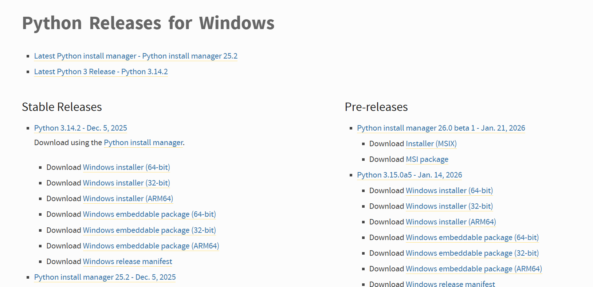
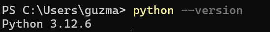

# Tarea 1.1

En este apartado estaran las captures correspondiente al laboratorio 1.1 de lo solicitado aca:

Instalar python en windows/linux:

Verificar python con --version:

Ejecutar el modo interactivo:

Uso basico de help() y dir():

