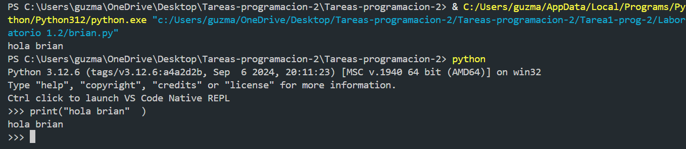

En este apartado estaran las captures correspondiente al laboratorio 1.2 de lo solicitado aca:

Crear un script tipo brian.py:

uso de print():

Ejecucion desde la consola:

Diferencia entre scripts y modo interactivo:

En mi opinion es super facil en scripts en este caso para ejecutar codigo python necesitamos un entorno de trabajo como vs code y archivos para que codigo pueda ejecutarse.

Sin embargo en el modo interactivo es mas directo ya que se ejecuta directamente en la terminal, obviamente dentro del interactivo de python.

