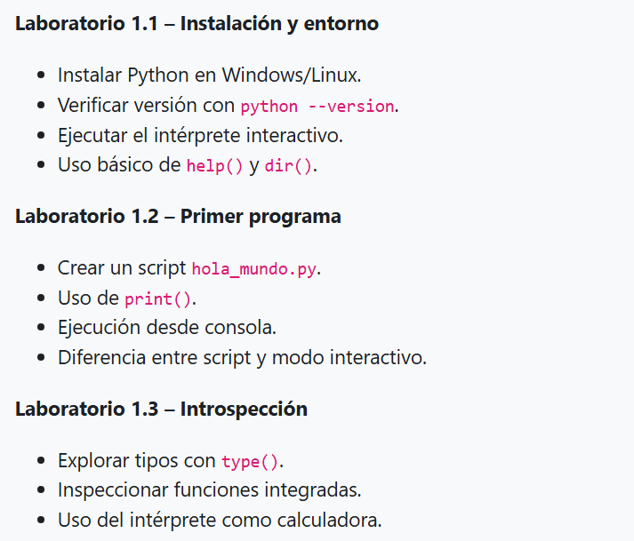
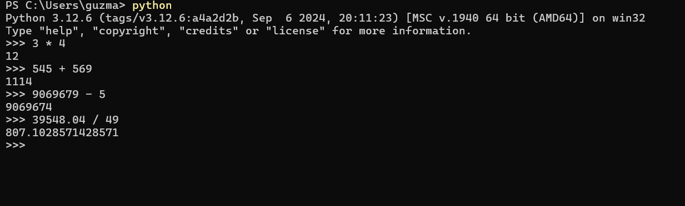

# Tarea 1.3

En este apartado estaran las captures correspondiente al laboratorio 1.1 de lo solicitado aca:

.

Explorar tipos con type():

.

Inspeccionar funciones integradas:

.

Uso del interprete como calculadora:

.
 
