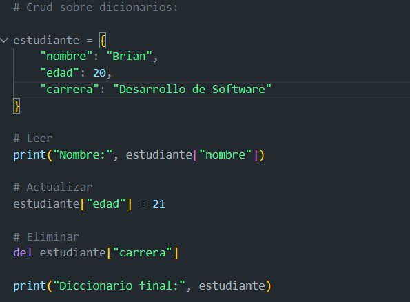

# Tarea 2.3

En este apartado estaran las captures correspondiente al laboratorio 2.3 de lo solicitado aca:

 Crud sobre dicionarios:

 

 Eliminación de duplicados con conjuntos:

 

 Caso práctico de modelado de datos:

 